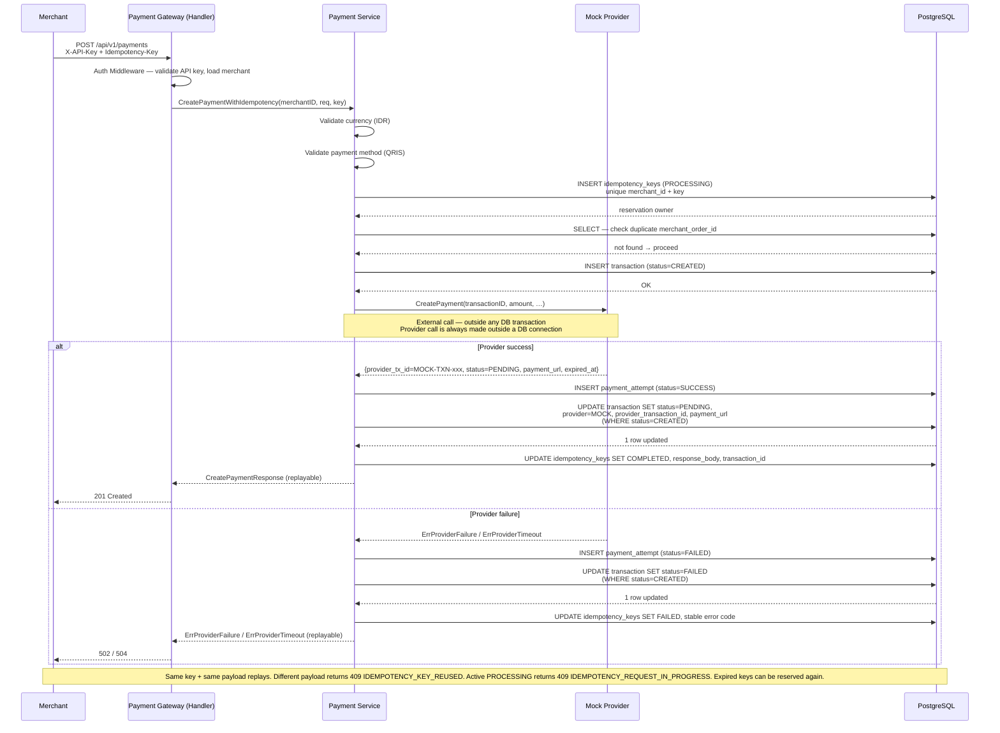
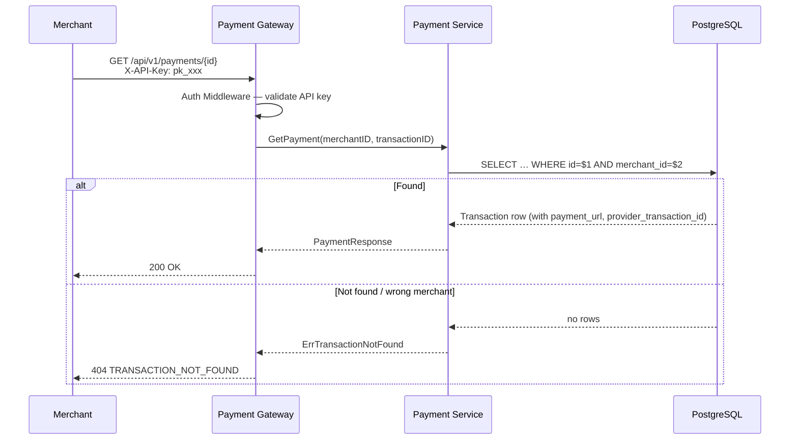
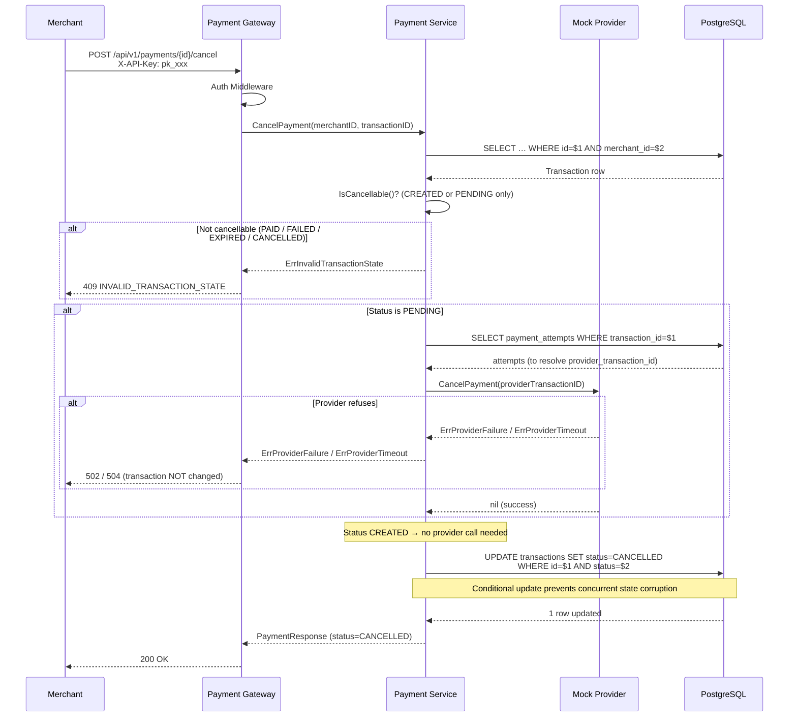
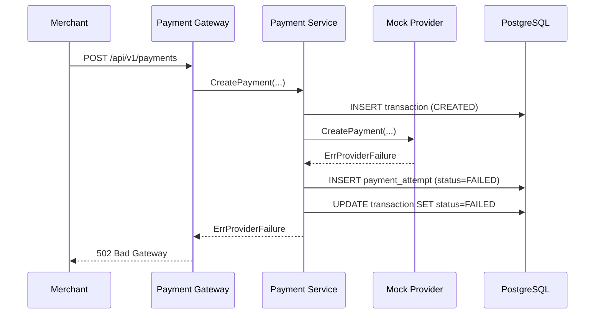
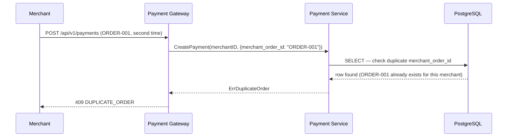
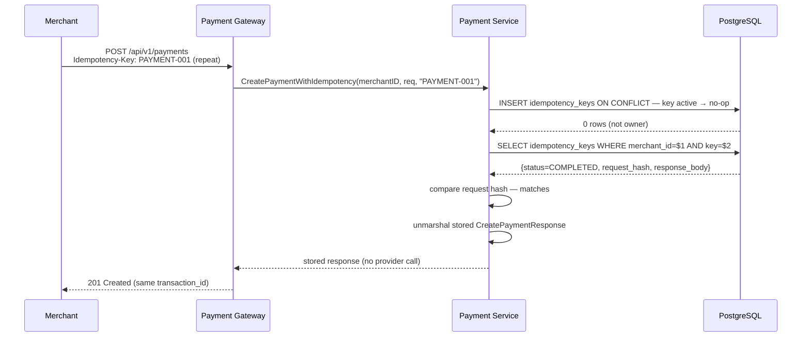
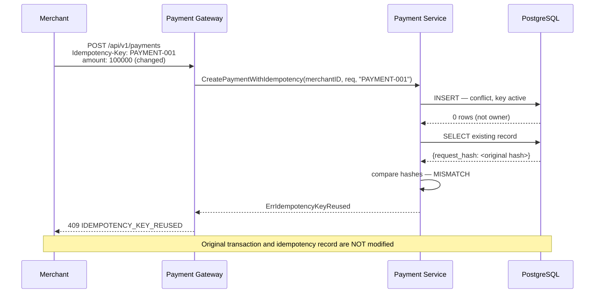
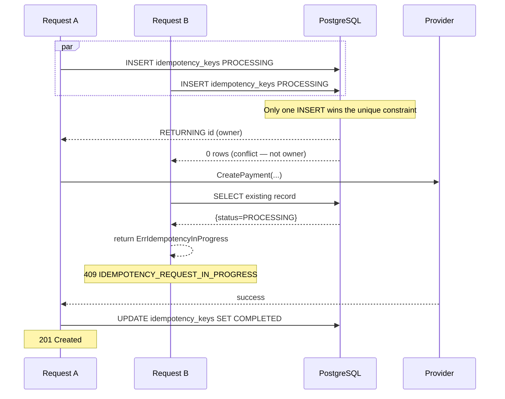
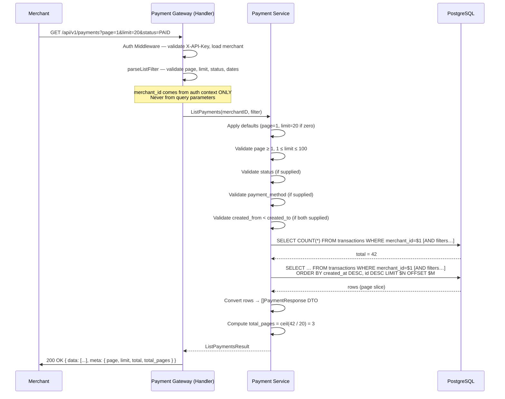
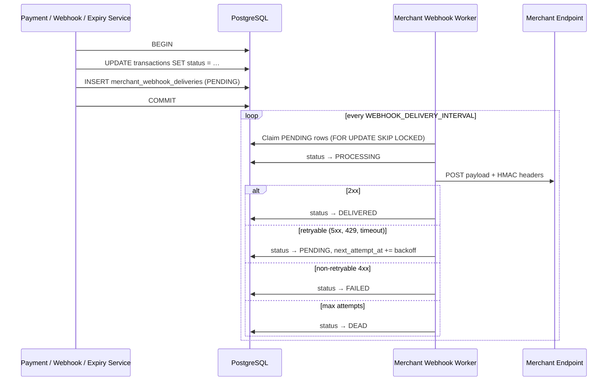

# Payment Flow Documentation

## Overview

This document describes the end-to-end flow for each payment operation.

---

## 1. Create Payment Flow

### Sequence



### Atomicity Design

The external provider call **cannot** participate in a PostgreSQL transaction.
The chosen design avoids holding a DB connection open across a slow network call:

| Step | DB transaction? | Notes |
|------|----------------|-------|
| 1. Validate | No | Pure in-memory checks |
| 2. Duplicate check | No | SELECT — read only |
| 3. INSERT transaction (CREATED) | No | Isolated write |
| 4. Call provider | No | External I/O — may be slow |
| 5. INSERT payment_attempt | No | Audit trail — always written |
| 6. UPDATE transaction status | No | Conditional: `WHERE status=CREATED` |

If step 4 fails, steps 5 and 6 still run to record the failure.
If step 6 fails after a successful provider call, the attempt is already saved
and the discrepancy is logged as a critical error for manual resolution.

---

## 2. Get Payment Flow



### Merchant Isolation

The SQL query always includes `AND merchant_id = $merchantID`.
There is **no** secondary check after fetching — the DB is the enforcement point.
A transaction belonging to Merchant B returns `404` to Merchant A,
identical to a non-existent transaction. This prevents information leakage.

---

## 3. Cancel Payment Flow



### Concurrency Safety

The `UPDATE … WHERE status = $currentStatus` pattern acts as an optimistic lock.
If a concurrent request has already changed the status, `RowsAffected() == 0`
and `ErrTransactionNotFound` is returned, causing a `409` response.
This prevents two concurrent cancel requests from both succeeding.

---

## 4. Provider Failure Flow

With `PAYMENT_PROVIDER=midtrans`, the same flow invokes the Midtrans Snap adapter.
Calls are context-aware and are never automatically retried after a timeout.



**Transaction state after provider failure:**

| Field | Value |
|-------|-------|
| status | FAILED |
| provider | (not set — provider was never reached successfully) |
| payment_url | null |
| provider_transaction_id | null |

The `payment_attempts` table records the failed attempt for full audit trail.

---

## 5. Duplicate Order Flow



**Note:** The uniqueness constraint is per-merchant.
`Merchant A + ORDER-001` and `Merchant B + ORDER-001` are two different orders.

---

## 6. Transaction State Machine

```
          ┌─────────────────────────────────────────────┐
          │                                             │
       CREATED ──────────────────────────────────► CANCELLED
          │                                             ▲
          ▼                                             │
       PENDING ──────────────────────────────────────── ┘
          │
          ├──────────────────► PAID       (terminal — Phase 3+)
          │
          ├──────────────────► FAILED     (terminal)
          │
          └──────────────────► EXPIRED    (terminal — Phase 3+)
```

| From | To | Trigger |
|------|----|---------|
| CREATED | PENDING | Provider accepts payment |
| CREATED | FAILED | Provider rejects at creation |
| CREATED | CANCELLED | Merchant cancels before provider call |
| PENDING | PAID | Payment received (webhook/polling — Phase 3+) |
| PENDING | FAILED | Provider reports failure |
| PENDING | EXPIRED | Expiry job runs (Phase 3+) |
| PENDING | CANCELLED | Merchant cancels + provider confirms |

All transitions are validated by `TransactionStatus.CanTransitionTo()` in
`internal/model/transaction.go`. The service layer enforces this before any DB write.

---

## 7. Provider Error Scenarios Summary

| Scenario | Transaction Status | Payment Attempt | HTTP |
|----------|--------------------|-----------------|------|
| Provider accepts | PENDING | SUCCESS | 201 |
| Provider rejects create (ErrProviderFailure) | FAILED | FAILED | 502 |
| Provider timeout on create (ErrProviderTimeout) | FAILED | FAILED | 504 |
| Provider cancel refuses | Unchanged (CREATED/PENDING) | — | 502 |
| Provider cancel timeout | Unchanged (CREATED/PENDING) | — | 504 |

The `payment_attempts` table is the full audit trail for every provider interaction.

---

## 8. Idempotency State Machine

Every `POST /api/v1/payments` request creates or reuses an `idempotency_keys` row.
The row is scoped to `(merchant_id, key)` and moves through three states:

```
                    Reserve (INSERT)
                          │
                          ▼
                     PROCESSING          ← key is held; provider call in flight
                          │
              ┌───────────┴───────────┐
              │                       │
              ▼                       ▼
          COMPLETED               FAILED
    (success result stored)  (error code stored)
              │                       │
         replayed as                replayed as
           HTTP 201               HTTP 502/504
```

| Status | Description | Replay behaviour |
|--------|-------------|-----------------|
| `PROCESSING` | Reservation held; provider call in flight | `409 IDEMPOTENCY_REQUEST_IN_PROGRESS` |
| `COMPLETED` | Successful payment stored as JSONB | Return stored response (HTTP 201) |
| `FAILED` | Provider error stored as stable error code | Return stored error (HTTP 502/504) |

Records expire after `IDEMPOTENCY_TTL` (default `24h`). An expired record is
replaced atomically on the next `Reserve` call — no cleanup worker is needed.

---

## 9. Idempotency Replay Flow

### 9a. COMPLETED replay



### 9b. Payload mismatch



---

## 10. Concurrent Request Flow

Two goroutines submit the same key at the same time. PostgreSQL's unique
constraint on `(merchant_id, key)` is the sole arbitration mechanism —
no application-level mutex or map is used.



**Invariants guaranteed:**

| Invariant | Mechanism |
|-----------|-----------|
| At most one provider call per (merchant, key) | PostgreSQL UNIQUE(merchant_id, key) |
| At most one transaction per reservation | Reserve-then-create sequence; duplicate order check inside |
| No second provider call on FAILED replay | FAILED status checked before any processing |
| No second provider call on COMPLETED replay | COMPLETED status checked before any processing |
| No second provider call on timeout | Timeout stored as FAILED; replayed, never retried |

---

## 11. Provider Timeout — Ambiguous External Result

When the provider call times out, the gateway has already sent the request.
The external payment **may or may not** have been created. The gateway:

1. Records the attempt as `FAILED` in `payment_attempts`.
2. Marks the transaction `FAILED` in `transactions`.
3. Stores `FAILED` + `PAYMENT_PROVIDER_TIMEOUT` error code in `idempotency_keys`.
4. Returns `504 PAYMENT_PROVIDER_TIMEOUT` to the merchant.

On replay (same key + same payload), the stored `504` is returned without
calling the provider again. This prevents a second external charge at the cost
of not confirming whether the first charge succeeded.

**If the provider supports idempotency** (e.g. Midtrans uses `order_id` as a
natural key), the merchant can query the provider directly to reconcile the
ambiguous charge. The gateway does not perform this reconciliation automatically.

## Phase 7C Settlement Flow

Provider settlement evidence is imported through the dedicated admin API, persisted atomically with its items, then reconciled explicitly:

```text
provider report
    |
    v
admin import --(provider + settlement_ref + payload hash)--> IMPORTED
    |
    v
reconcile --(provider IDs, lifecycle, currency, amount)--> RECONCILED / PARTIAL / MISMATCH
    |
    v
ops reviews audit result and may rerun
```

This flow never changes `transactions.status`, transaction amount, refund status, or refund counters. Settlement is external evidence only.

Exact-once provider execution cannot be guaranteed by the gateway alone when
the provider does not support idempotency on its end.

---

## 12. Payment Listing Flow (Phase 5B)

### Sequence



### Merchant Isolation Guarantee

The `merchant_id` parameter in every query is sourced exclusively from the
authenticated merchant stored in the Gin context by the `Auth` middleware.
The repository always prepends `WHERE merchant_id = $1` before any optional
filter. A merchant cannot enumerate another merchant's transactions — even by
guessing a `merchant_order_id` that belongs to another merchant, because the
scoped count and list will return zero results.

### Date Range Semantics

```
created_from = 2026-01-01T00:00:00Z  →  created_at >= 2026-01-01 00:00:00 UTC  (inclusive)
created_to   = 2026-02-01T00:00:00Z  →  created_at <  2026-02-01 00:00:00 UTC  (exclusive)
```

This half-open interval `[from, to)` is standard and consistent with ISO 8601
interval notation. Specifying only one boundary is allowed.

### Deterministic Ordering

`ORDER BY created_at DESC, id DESC` is fixed and not client-controllable.
The `id DESC` tie-breaker ensures stable results when multiple rows share the
same `created_at` timestamp, which is common when transactions are created in
rapid succession or in bulk tests.

### Page Beyond Last Page

Requesting a page that exceeds the available data returns an empty `data` array
with the accurate `total` and `total_pages` values unchanged. This is not an
error — it matches the behaviour of standard REST APIs and allows clients to
detect end-of-results via `len(data) == 0`.

### Index Strategy

Migration `000009` adds two composite indexes specifically for this endpoint:

| Index | Columns | Use case |
|-------|---------|----------|
| `idx_transactions_merchant_created_at` | `(merchant_id, created_at DESC, id DESC)` | Unfiltered listing |
| `idx_transactions_merchant_status_created_at` | `(merchant_id, status, created_at DESC, id DESC)` | Status-filtered listing |

Both indexes support the `ORDER BY created_at DESC, id DESC` sort without a
separate sort step, making large paginated queries efficient.

---

## 12. Merchant Outbound Webhook Flow (Phase 6)

Distinct from §7 (inbound provider webhooks). This is **gateway → merchant**.

### Outbox enqueue (same DB transaction as status change)



### At-least-once semantics

Every delivery carries a stable `evt_…` ID in `X-PayGate-Event-ID` and in the
JSON payload. Retries reuse the same event ID — merchants must deduplicate.

See [merchant-webhooks.md](./merchant-webhooks.md) for signature format, retry
schedule, and configuration API.

---

## Phase 7B — Refund flow (IMPLEMENTED)

> Full documentation: [refunds.md](./refunds.md). Design background: [phase-7a-financial-design.md](./phase-7a-financial-design.md).

```mermaid
sequenceDiagram
    participant M as Merchant
    participant API as Refund API
    participant S as RefundService
    participant DB as PostgreSQL
    participant P as RefundProvider
    participant O as Outbox Worker

    M->>API: POST /payments/:id/refunds + Idempotency-Key
    API->>S: CreateRefundWithIdempotency
    S->>DB: Reserve idempotency key
    S->>DB: FOR UPDATE transaction + insert refund PENDING + reserve amount + outbox refund.created
    S->>P: CreateRefund (outside DB tx)
    alt Provider success (sync)
        P-->>S: SUCCEEDED + provider_refund_id
        S->>DB: SUCCEEDED + move reserved→refunded + outbox refund.succeeded
        S->>DB: Complete idempotency
        API-->>M: 201 Created
    else Provider async
        P-->>S: PROCESSING + provider_refund_id
        S->>DB: PROCESSING + outbox refund.processing
        Note over DB: Later REFUND_SUCCEEDED webhook finalizes
    else Provider timeout
        P-->>S: ErrProviderTimeout
        Note over S,DB: Refund stays PENDING; reservation held
        API-->>M: 504 REFUND_PROVIDER_TIMEOUT
    else Provider hard failure
        P-->>S: ErrProviderFailure
        S->>DB: FAILED + release reservation + outbox refund.failed
        API-->>M: 502 REFUND_PROVIDER_ERROR
    end
    O->>M: refund.* webhook (at-least-once)
```

**Concurrency:** Concurrent creates serialize on `SELECT … FOR UPDATE` of the parent transaction. PENDING and PROCESSING both reserve balance.

**Idempotency:** Same key + same payload replays. Same key + different payload → `409 IDEMPOTENCY_KEY_REUSED`.
