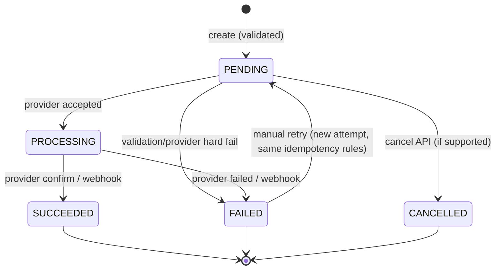
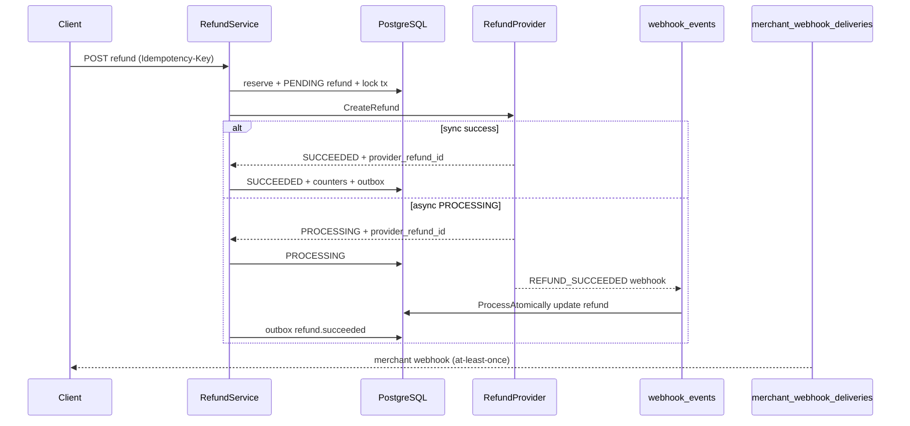
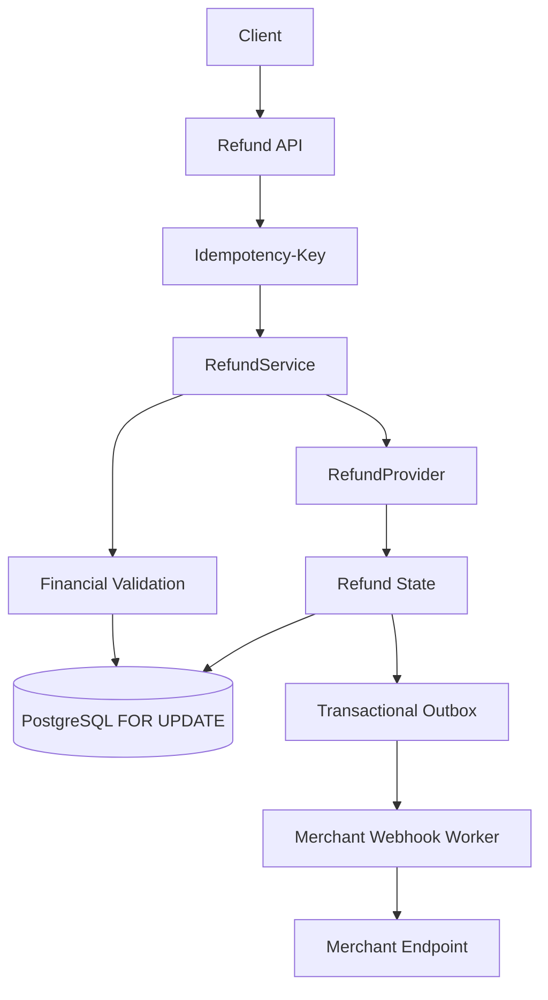
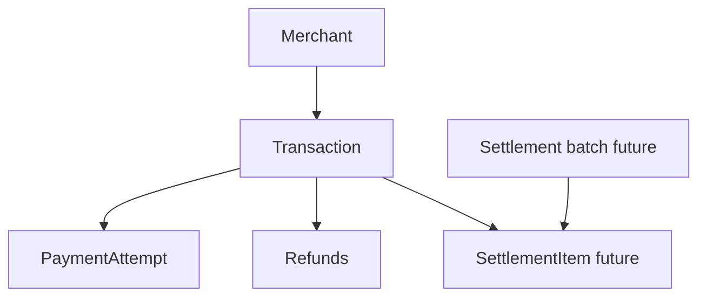
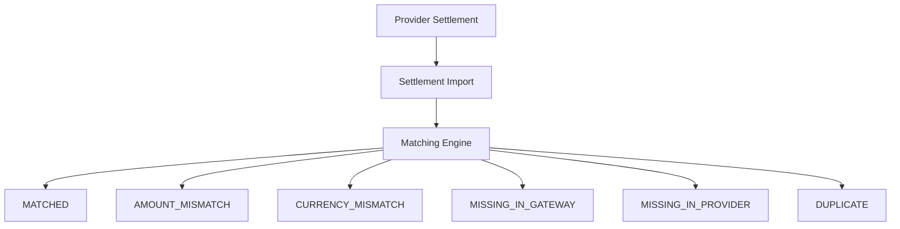

# Phase 7A — Financial Data Model & Refund Design

> **Status:** DESIGN ONLY (Phase 7A). Nothing in this document is implemented unless explicitly marked **CURRENT**.
>
> **Authority:** This design is derived from the repository as of migrations `000001`–`000011`, models under `internal/model/`, and services under `internal/service/`.

---

## 1. Executive Summary

Phase 7A defines the financial foundation for **refunds**, **settlements**, and **reconciliation** without implementing those features yet.

**Key conclusions:**

| Question | Decision |
|----------|----------|
| Financial truth for captured payment? | **`transactions`** row when `status = PAID`: `amount`, `currency`, `paid_at`, `provider_transaction_id` |
| Separate ledger required? | **No full double-entry ledger** for Phase 7. **Option B (lightweight):** `transactions` + **`refunds`** + optional **denormalized counters** on `transactions` for fast invariant checks |
| Refund entity | New table **`refunds`** (matches plural naming: `transactions`, `payment_attempts`) |
| Over-refund protection | **PostgreSQL transaction** + **`SELECT … FOR UPDATE`** on parent transaction + **reservation model** (PENDING/PROCESSING count toward cap) |
| Idempotency | Reuse **`idempotency_keys`** pattern: extend with **`refund_id`** + refund-specific **`RequestHash`** (Phase 7B migration) |
| Provider abstraction | New **`RefundProvider`** interface (same package as `PaymentProvider`; shared adapter wiring in `main.go`) |
| Inbound provider events | Reuse **`webhook_events`** with new event types (e.g. `REFUND_SUCCEEDED`); same idempotency `(provider, event_id)` |
| Outbound merchant events | Extend Phase 6 outbox; new event types e.g. `refund.succeeded` ( **PROPOSED** ) |
| Settlement / reconciliation | New tables **`settlements`**, **`settlement_items`**, **`reconciliation_runs`**, **`reconciliation_items`** (Phase 7C+) |

Delivery semantics remain **AT-LEAST-ONCE** for merchant webhooks (Phase 6 guarantee preserved).

---

## 2. Existing Architecture Audit

### 2.1 Layering (**CURRENT**)

```text
HTTP (Gin) → Middleware (auth, logging) → Handler → Service → Repository → PostgreSQL (pgx)
```

- **Config:** `internal/config` — env vars including `WEBHOOK_SECRET_ENCRYPTION_KEY`, webhook delivery tuning.
- **Responses:** `pkg/response` — stable envelope + error codes (`INVALID_REQUEST`, `TRANSACTION_NOT_FOUND`, `IDEMPOTENCY_KEY_REUSED`, …).
- **Errors:** Repository sentinels in `internal/repository/errors.go`; HTTP mapping in handlers/services.

### 2.2 Migrations inventory (**CURRENT**)

| Migration | Purpose |
|-----------|---------|
| `000001` | `merchants` |
| `000002` | `transactions` — amount `BIGINT`, `(merchant_id, merchant_order_id)` UNIQUE |
| `000003` | `payment_attempts` — outbound provider API audit |
| `000004` | `transactions.provider_transaction_id`, `payment_url` |
| `000005` | `webhook_events` — inbound provider idempotency `(provider, event_id)` UNIQUE |
| `000006` | Expiry index on `transactions` |
| `000007` | `idempotency_keys` — payment create only today |
| `000008` | `merchant_api_keys` |
| `000009` | Transaction listing indexes |
| `000010` | `merchant_webhook_configs` |
| `000011` | `merchant_webhook_deliveries` — transactional outbox |

**Rule for Phase 7B+:** New work starts at **`000012`**. Do not edit `000001`–`000011`.

### 2.3 Payment orchestration (**CURRENT**)

- **`PaymentService`** (`internal/service/payment_service.go`):
  - Creates `CREATED` transaction; calls **`PaymentProvider.CreatePayment`**.
  - On success → `PENDING` + provider fields via **`OutboxStatusUpdater`** (atomic status + merchant outbox).
  - **`CreatePaymentWithIdempotency`** — reserves `idempotency_keys`, completes with stored HTTP 201 body.
- **`PaymentProvider`** (`internal/service/payment_provider.go`):
  - `CreatePayment`, `GetPayment`, `CancelPayment` — **no refund methods today**.
- **`payment_attempts`**: records each outbound provider call (JSON payloads).

### 2.4 Inbound provider webhooks (**CURRENT**)

- **`WebhookService`** + **`webhook_event_repository.ProcessAtomically`**:
  - Insert `webhook_events` (idempotent on `(provider, event_id)`).
  - `FOR UPDATE` load transaction by `(provider, provider_transaction_id)`.
  - Conditional `UPDATE transactions` + optional **`outbox` callback** in same DB transaction.
- Event types in code: `PAYMENT_PAID`, `PAYMENT_FAILED`, `PAYMENT_EXPIRED`.
- Amount/currency validated against transaction when present in payload.

### 2.5 Outbound merchant webhooks (**CURRENT**)

- **`MerchantWebhookPublisher.EnqueueInTx`** — inserts `merchant_webhook_deliveries` in same tx as status change.
- Stable **`event_id`** (`evt_…` prefix, generated once per logical event).
- **`UNIQUE (merchant_id, event_id)`** — duplicate enqueue is ignored.
- Dispatcher worker: `FOR UPDATE SKIP LOCKED` claim, retries, DEAD letter.

### 2.6 Transaction state machine (**CURRENT**)

Defined in `internal/model/transaction.go`:

```text
CREATED → PENDING | CANCELLED
PENDING → PAID | FAILED | EXPIRED | CANCELLED
PAID / FAILED / EXPIRED / CANCELLED → (terminal)
```

Refunds apply only when parent transaction is **`PAID`**. Refunds do **not** change transaction status to a new terminal “partially refunded” state in Phase 7B (see §5); optional **`refunded_amount`** column summarizes money movement.

### 2.7 Authentication & tenant isolation (**CURRENT**)

- Middleware resolves **`merchant_id`** from API key (legacy `pk_…` or compound `pk_…:sk_…`).
- Merchant-scoped reads use **`FindByMerchantAndID`** (`WHERE id = $1 AND merchant_id = $2`).
- Cross-merchant resource access → **404** (not 403) for transactions — refund APIs should follow the same pattern for IDs.

---

## 3. Existing Financial Model

This section documents what the codebase **already** treats as financial state.

### 3.1 Merchants

- **Not a ledger account.** Tenant root; no balance field.
- **CURRENT fields:** `id`, `status` (`ACTIVE` | `INACTIVE` | `SUSPENDED`).

### 3.2 Transactions — **authoritative payment record**

| Field | Financial meaning |
|-------|-------------------|
| `amount` | Intended capture amount (smallest unit, `CHECK > 0`) |
| `currency` | ISO 4217 (`IDR` supported in code) |
| `status` | Lifecycle; **`PAID`** = successful capture |
| `paid_at` | Set when status becomes `PAID` |
| `provider_transaction_id` | Provider payment reference (set at `PENDING`) |
| `merchant_order_id` | Merchant reference; unique **per merchant**, not globally |

**Financial truth for “money collected”:** a row with **`status = PAID`**. The **`amount`** at time of payment is the gross captured amount (immutable after PAID — see §16).

There is **no** `refunded_amount`, **no** ledger entries, **no** settlement linkage today.

### 3.3 Payment attempts

- Audit of **outbound** provider HTTP/API calls for **payment creation** (and related).
- Not used for inbound webhooks (`webhook_events` is separate by design — see model comments).

### 3.4 Webhook events (inbound)

- Idempotency + audit for **provider → gateway** events.
- May drive transition to `PAID` / `FAILED` / `EXPIRED`.
- **Not** a general financial ledger; event payload is evidence, not balanced entries.

### 3.5 Merchant webhook deliveries (outbound)

- Notification outbox; **not** financial truth.
- Payload mirrors transaction snapshot via `PaymentDataFromTransaction`.

### 3.6 Idempotency keys

- Scope: **`merchant_id` + `key`** UNIQUE.
- **`request_hash`**: canonical hash of create-payment fields (`PaymentRequestHash`).
- Stores **`transaction_id`** on success — refund flow will add **`refund_id`** (**PROPOSED**).

---

## 4. Financial Domain Principles

1. **A payment transaction is not a complete financial ledger.** It is the **payment intent + outcome** record. Refunds are **separate rows** that reference the paid transaction.
2. **Integer money only** — continue `int64` + explicit `currency` (never `float64`).
3. **Immutability of historical facts** — do not UPDATE `transactions.amount` / `currency` after `PAID`. Corrections use **new refund/compensation rows**.
4. **Database-enforced invariants** where possible (CHECK, UNIQUE, FK); Go validates UX, Postgres validates correctness under concurrency.
5. **No process-local locks** — all refund caps enforced in **PostgreSQL** with row locks.
6. **Reuse Phase 6 outbox** — one delivery mechanism; extend event types and payload builders only.
7. **AT-LEAST-ONCE** merchant delivery — financial state must be correct even if webhook duplicates.

---

## 5. Refund Domain

### 5.1 Entity: `refunds` (**PROPOSED**)

One row = one refund operation (full or partial).

| Concept | Design |
|---------|--------|
| Identity | UUID `id` (gateway primary key) |
| Parent | `transaction_id` FK → `transactions.id` |
| Tenant | `merchant_id` FK (denormalized from transaction for isolation indexes) |
| Money | `amount BIGINT`, `currency VARCHAR(3)` — must match parent at creation |
| Merchant reference | Optional `merchant_refund_id VARCHAR(100)` UNIQUE per `(merchant_id, merchant_refund_id)` if provided |
| Provider | `provider`, `provider_refund_id` (nullable until known) |
| Reason | Optional `reason TEXT` |
| Idempotency | Optional `idempotency_key_id` FK → `idempotency_keys.id` |
| Lifecycle | `status`, timestamps (`requested_at`, `succeeded_at`, …) |

### 5.2 Full, partial, and multiple refunds

- **Full:** single refund with `amount = transaction.amount` (only if no other successful/reserved refunds).
- **Partial:** any `amount < transaction.amount` such that sum of **reserved + succeeded** ≤ `transaction.amount`.
- **Multiple:** many rows per `transaction_id`; cap enforced by aggregate + reservation rules (§7, §9).

### 5.3 Relationship to transaction status

**Recommendation (Phase 7B):** Keep transaction **`PAID`** after refunds. Expose derived fields in API:

```json
"refunded_amount": 50000,
"refundable_amount": 50000
```

Optional later: `PARTIALLY_REFUNDED` / `REFUNDED` **display statuses** in API only (computed), without breaking the existing CHECK constraint on `transactions.status` until a migration explicitly adds them.

### 5.4 Refund attempts (**PROPOSED**, mirrors `payment_attempts`)

Table **`refund_attempts`**: outbound provider calls for refund create/status (request/response JSON, attempt number). Keeps **`refunds`** row stable while attempts accumulate.

---

## 6. Refund State Machine

Align naming with existing enums (`UPPER_SNAKE`, VARCHAR checks in SQL).

### 6.1 States (**PROPOSED**)

| Status | Meaning |
|--------|---------|
| `PENDING` | Accepted by gateway; reserved against refundable balance; provider call not yet confirmed |
| `PROCESSING` | Provider acknowledged; async completion possible |
| `SUCCEEDED` | Provider confirmed success; **amount immutable** |
| `FAILED` | Terminal failure (provider rejected or unrecoverable error) |
| `CANCELLED` | Merchant/gateway cancelled before provider success |

### 6.2 Transitions



### 6.3 Policy answers

| Question | Decision |
|----------|----------|
| Can **FAILED** retry? | **Yes** — either new refund row with new idempotency key, or **explicit “retry refund”** operation that transitions FAILED → PENDING if provider allows same reference (provider-specific; default: **new refund row** safer) |
| Can **SUCCEEDED** change? | **No** — terminal; corrections via **new compensating refund** (credit) is out of scope; use support process |
| Cancel **PENDING**? | **Yes** — releases reservation |
| Provider timeout after accept? | Stay **PROCESSING**; reconciliation via **GetRefund** poll job + inbound webhook |
| API timeout after provider accept? | Client retries **same Idempotency-Key** → replay same refund row (§8) |
| Duplicate provider response | **UNIQUE (provider, provider_refund_id)** when not null; webhook idempotency `(provider, event_id)` |
| **PROCESSING** stuck | Admin/worker marks FAILED after TTL + investigation (Phase 7B+ ops) |

---

## 7. Refund Invariants

### 7.1 Hard invariants

```text
transaction.amount > 0
refund.amount > 0
refund.currency = transaction.currency (at creation; both immutable)
refund allowed only if transaction.status = PAID
sum_reserved(refunds) + sum_succeeded(refunds) <= transaction.amount
SUCCEEDED refund.amount is immutable
provider_refund_id unique per provider when present
merchant_id on refund matches transaction.merchant_id (FK + app check)
```

Where:

```text
sum_reserved = SUM(amount) WHERE status IN ('PENDING', 'PROCESSING')
sum_succeeded = SUM(amount) WHERE status = 'SUCCEEDED'
```

### 7.2 Reservation policy (**critical**)

**PENDING** and **PROCESSING** **both reserve** refundable balance.

Example: Payment 100,000 — Refund A **PROCESSING** 60,000 → Refund B 50,000 **rejected** (`REFUND_AMOUNT_EXCEEDED`).

**Why:** Prevents double spend across concurrent requests before provider confirms.

On **FAILED** or **CANCELLED**, reservation is released (amount excluded from sum).

### 7.3 Denormalized counters (**PROPOSED** on `transactions`)

Add in migration `000012+`:

```text
refunded_amount BIGINT NOT NULL DEFAULT 0   -- sum SUCCEEDED refunds
reserved_refund_amount BIGINT NOT NULL DEFAULT 0  -- sum PENDING+PROCESSING
```

Maintained **only inside** the same DB transaction that changes refund status (single source of truth still `refunds` table; counters enable fast CHECK):

```sql
CHECK (refunded_amount >= 0)
CHECK (reserved_refund_amount >= 0)
CHECK (refunded_amount + reserved_refund_amount <= amount)
```

If counters drift, a periodic reconciler can recompute from `refunds` (ops tool, not hot path).

---

## 8. Refund Idempotency

### 8.1 Reuse `idempotency_keys` (**PROPOSED** extension)

**CURRENT** table supports payment create only (`transaction_id` FK).

**PROPOSED migration:**

- Add nullable **`refund_id UUID REFERENCES refunds(id)`**.
- Extend **`PaymentRequestHash`** pattern with **`RefundRequestHash(refundReq)`** using length-delimited canonical string (same style as `PaymentRequestHash` in `idempotency_key.go`).

**Scope remains:** `(merchant_id, key)` UNIQUE — sufficient for HTTP idempotency.

### 8.2 Flow

```text
Client POST /payments/:id/refunds + Idempotency-Key
  → Reserve idempotency (hash must match)
  → BEGIN
  → FOR UPDATE transaction
  → INSERT refund PENDING (or replay if idempotency COMPLETED)
  → COMMIT
  → Call RefundProvider (outside txn)
  → BEGIN → update refund + counters + complete idempotency + outbox → COMMIT
```

### 8.3 Same key, different payload

→ **`IDEMPOTENCY_KEY_REUSED`** (existing code `CodeIdempotencyKeyReused`).

### 8.4 Provider-side idempotency

Store **`provider_refund_id`** when returned. **UNIQUE (provider, provider_refund_id)** prevents duplicate financial rows if webhook + API both arrive.

Merchant-supplied **`merchant_refund_id`** optional UNIQUE `(merchant_id, merchant_refund_id)` for merchant replay semantics.

---

## 9. Concurrency Strategy

### 9.1 Algorithm (multi-instance safe)

All instances execute:

```sql
BEGIN;
SELECT id, amount, currency, status, refunded_amount, reserved_refund_amount
FROM transactions
WHERE id = $1 AND merchant_id = $2
FOR UPDATE;

-- assert status = 'PAID'
-- assert currency match
-- assert refunded_amount + reserved_refund_amount + $new_amount <= amount

INSERT INTO refunds (...) VALUES (...);

UPDATE transactions
SET reserved_refund_amount = reserved_refund_amount + $new_amount,
    updated_at = NOW()
WHERE id = $1;

COMMIT;
```

After provider success:

```sql
BEGIN;
SELECT ... FROM refunds WHERE id = $1 FOR UPDATE;
-- transition to SUCCEEDED
UPDATE transactions
SET reserved_refund_amount = reserved_refund_amount - $amount,
    refunded_amount = refunded_amount + $amount
WHERE id = $transaction_id;
COMMIT;
```

### 9.2 Why this works

- **`FOR UPDATE`** on the **transaction** row serializes all refund creates for that payment.
- **Denormalized counters** make over-refund a single-row CHECK failure even if application logic regresses.
- No `sync.Mutex`, no Redis.

### 9.3 Isolation

Default **READ COMMITTED** is sufficient with explicit row locks. Do not rely on snapshot isolation alone.

### 9.4 Concurrent stress test (Phase 7B)

≥ **10 concurrent** refund POSTs against one **PAID** 100,000 transaction: assert **`SUM(succeeded amounts) ≤ 100,000`** and no CHECK violations.

---

## 10. Provider Refund Abstraction

### 10.1 Decision

Introduce **`RefundProvider`** in `internal/service` (**PROPOSED**), separate from **`PaymentProvider`**.

| Approach | Verdict |
|----------|---------|
| Extend `PaymentProvider` with refund methods | Rejects — violates interface segregation; mocks/tests for payments shouldn’t require refund stubs |
| `RefundProvider` | **Chosen** — implemented by same concrete type (`MockPaymentProvider`, `Midtrans…`) behind optional registration |

### 10.2 Interface sketch (**PROPOSED**)

```go
type RefundProvider interface {
    ProviderName() string // same string as PaymentProvider.Name()
    CreateRefund(ctx context.Context, req ProviderRefundCreateRequest) (*ProviderRefundResponse, error)
    GetRefund(ctx context.Context, providerRefundID string) (*ProviderRefundResponse, error)
    // CancelRefund only if provider supports; optional in Phase 7B
}
```

Errors: reuse **`ErrProviderFailure`**, **`ErrProviderTimeout`**.

### 10.3 Wiring

`cmd/server/main.go` registers provider bundle; **RefundService** receives `RefundProvider` selected by `transaction.provider`.

---

## 11. Async Refund Processing



- **Inbound:** extend **`webhook_events.event_type`** parsing (e.g. `REFUND_SUCCEEDED`, `REFUND_FAILED`). Link to **`refunds.id`** via `provider_refund_id` lookup (new index).
- **Duplicate webhook:** same as payments — `(provider, event_id)` UNIQUE; terminal refund → **IGNORED**.
- **Amount/currency** on webhook must match refund row or → **FAILED/IGNORED** with audit message.

---

## 12. Ledger Evaluation

### Option A — Transaction + refunds only

| Pros | Cons |
|------|------|
| Minimal schema | Aggregate queries on hot path |
| Easy mental model | Audit trail split across tables |
| Fast Phase 7B | Settlement/recon needs more joins |

### Option B — Transaction + refunds + summary counters / immutable financial events (**RECOMMENDED**)

| Pros | Cons |
|------|------|
| Strong invariants (CHECK on tx row) | Denormalization needs disciplined updates |
| Good audit via `refunds` + `refund_attempts` | Not a full accounting ledger |
| Fits SaaS scope | |

### Option C — Double-entry ledger

| Pros | Cons |
|------|------|
| Accounting-grade | High complexity, training, reporting scope explosion |
| | Overkill for current merchant API surface |

**Recommendation:** **Option B** for Phase 7B–7C. Revisit Option C only if product requires merchant balances, fees, and tax reporting in-gateway.

---

## 13. Audit Trail

**CURRENT** audit sources:

- `payment_attempts`, `webhook_events`, `merchant_webhook_deliveries`, structured logs.

**Insufficient alone for refunds** (need actor, refund state transitions, provider IDs).

**PROPOSED:**

1. **`refunds`** row — business facts (immutable amount after SUCCEEDED).
2. **`refund_attempts`** — provider request/response bodies (no secrets).
3. **`refund_status_history`** (optional Phase 7B+) — append-only `(refund_id, from_status, to_status, actor_type, actor_id, created_at, metadata JSONB)` for “who/when/previous/new state”.

Do **not** store API secrets, webhook secrets, or raw Authorization headers.

**Initiator identity:** `merchant_id` from auth + optional `api_key_id` (from Phase 5C context) in history metadata.

---

## 14. Settlement Domain

**Not implemented in Phase 7A.** Model for Phase 7C+.

### 14.1 Entities (**PROPOSED**)

**`settlements`** — one provider settlement batch (file/API import).

| Column | Notes |
|--------|-------|
| `id` | UUID PK |
| `provider` | e.g. MOCK, MIDTRANS |
| `provider_settlement_id` | UNIQUE per provider |
| `settlement_date` | date provider settled |
| `currency` | batch currency |
| `total_amount` | batch total (smallest unit) |
| `status` | IMPORTED, VALIDATED, RECONCILED, … |
| `raw_payload` | JSONB reference (optional) |

**`settlement_items`** — lines within a batch.

| Column | Notes |
|--------|-------|
| `settlement_id` | FK |
| `provider_transaction_id` | primary join key to gateway |
| `transaction_id` | FK nullable until matched |
| `gross_amount`, `fee_amount`, `net_amount` | int64 |
| `currency` | |
| `provider_line_reference` | optional line id |

**Model:** **one settlement batch → many transactions** (typical provider reports).

---

## 15. Reconciliation Domain

**PROPOSED tables:**

- **`reconciliation_runs`** — one execution (date range, provider, initiated_by).
- **`reconciliation_items`** — one compared pair or orphan.

---

## 16. Reconciliation Rules

### 16.1 Primary matching key

1. **`(provider, provider_transaction_id)`** → `transactions.provider_transaction_id` (**safest** — gateway already indexes this).
2. Fallback: **`(provider, provider_settlement_line_id)`** if payment ID absent on settlement line.
3. **`merchant_order_id`** — **fallback only** within merchant scope; never global unique.

### 16.2 Validations

- Amount: compare settlement **gross** to `transactions.amount` when status is PAID.
- Currency: must match.
- Duplicate settlement line → **`DUPLICATE`** item, no mutation of transaction.

### 16.3 Statuses (**PROPOSED**)

`MATCHED`, `AMOUNT_MISMATCH`, `CURRENCY_MISMATCH`, `MISSING_IN_GATEWAY`, `MISSING_IN_PROVIDER`, `DUPLICATE`, `UNRESOLVED`

---

## 17. Financial Discrepancies

Never UPDATE `transactions.amount` to match provider settlement.

Record **`reconciliation_items`** with:

- expected amount (from transaction),
- observed amount (from settlement),
- delta,
- status,
- notes.

Investigation workflow is ops/API (Phase 7C), not silent auto-adjust.

---

## 18. Proposed Database Schema

### 18.1 `refunds` (**PROPOSED** — migration `000012+`)

| Column | Type | Notes |
|--------|------|-------|
| id | UUID PK | |
| merchant_id | UUID FK merchants | tenant isolation |
| transaction_id | UUID FK transactions | |
| amount | BIGINT | CHECK > 0 |
| currency | VARCHAR(3) | |
| status | VARCHAR(30) | CHECK enum |
| merchant_refund_id | VARCHAR(100) NULL | UNIQUE (merchant_id, merchant_refund_id) WHERE NOT NULL |
| provider | VARCHAR(50) | from transaction |
| provider_refund_id | VARCHAR(150) NULL | UNIQUE (provider, provider_refund_id) WHERE NOT NULL |
| reason | TEXT NULL | |
| failure_code | VARCHAR(50) NULL | |
| failure_message | TEXT NULL | |
| idempotency_key_id | UUID FK NULL | |
| requested_at | TIMESTAMPTZ | |
| succeeded_at | TIMESTAMPTZ NULL | |
| failed_at | TIMESTAMPTZ NULL | |
| cancelled_at | TIMESTAMPTZ NULL | |
| created_at, updated_at | TIMESTAMPTZ | |

### 18.2 `refund_attempts` (**PROPOSED**)

Mirror `payment_attempts`: `refund_id`, `attempt_number`, payloads, status.

### 18.3 `transactions` alterations (**PROPOSED**)

```text
refunded_amount BIGINT NOT NULL DEFAULT 0
reserved_refund_amount BIGINT NOT NULL DEFAULT 0
CHECK (refunded_amount + reserved_refund_amount <= amount)
```

### 18.4 `idempotency_keys` alterations (**PROPOSED**)

```text
refund_id UUID NULL REFERENCES refunds(id)
```

### 18.5 Settlement / reconciliation

See §14–15 (Phase 7C migrations `000015+` tentative).

---

## 19. Proposed Constraints

- FK: `refunds.transaction_id` → `transactions.id`
- FK: `refunds.merchant_id` = transaction’s merchant (enforce via trigger or app + CHECK subquery deferred to Phase 7B)
- UNIQUE partial indexes on provider IDs
- Status CHECK constraints matching Go constants
- **No DELETE** on SUCCEEDED refunds (soft audit retention)

---

## 20. Proposed Indexes

| Table | Index | Use case |
|-------|-------|----------|
| refunds | `(merchant_id, created_at DESC)` | merchant refund list |
| refunds | `(transaction_id, status)` | aggregate reserved/succeeded |
| refunds | `(provider, provider_refund_id)` | webhook lookup |
| settlement_items | `(provider, provider_transaction_id)` | recon matching |
| reconciliation_items | `(run_id, status)` | ops dashboard |

---

## 21. Future API Contract

All **PROPOSED** — not implemented.

### 21.1 `POST /api/v1/payments/:id/refunds`

- **Auth:** `X-API-Key` (same as payments).
- **Idempotency:** `Idempotency-Key` header (required).
- **Body:** `{ "amount": 30000, "currency": "IDR", "reason": "...", "merchant_refund_id": "optional" }`
- **Authz:** `:id` resolved via `FindByMerchantAndID`.
- **201:** refund object + derived `refundable_amount`.
- **Errors:** see §22.

### 21.2 `GET /api/v1/refunds/:id`

- Merchant-scoped by `refund_id` + `merchant_id`.

### 21.3 `GET /api/v1/payments/:id/refunds`

- Paginated list (`meta.page`, `meta.total`, …).

### 21.4 `POST /api/v1/refunds/:id/cancel` (optional)

- Only `PENDING` → `CANCELLED`.

### 21.5 Admin settlement (internal, Phase 7C)

- `POST /api/v1/admin/settlements/import` — separate admin auth (future).

---

## 22. Future Error Codes

Inspect **CURRENT** catalog in `pkg/response/response.go` before adding.

**PROPOSED** (no duplicates):

| Code | When |
|------|------|
| `REFUND_NOT_FOUND` | 404 |
| `REFUND_NOT_ALLOWED` | e.g. tx not PAID |
| `REFUND_AMOUNT_EXCEEDED` | over cap / bad partial |
| `REFUND_ALREADY_COMPLETED` | idempotent replay conflict on state |
| `REFUND_IN_PROGRESS` | optional alias if not reusing `IDEMPOTENCY_REQUEST_IN_PROGRESS` |
| `REFUND_PROVIDER_ERROR` | map from `ErrProviderFailure` |
| `REFUND_PROVIDER_TIMEOUT` | map from `ErrProviderTimeout` |
| `REFUND_CURRENCY_MISMATCH` | |
| `REFUND_TRANSACTION_NOT_PAID` | specific variant of NOT_ALLOWED |
| `SETTLEMENT_NOT_FOUND` | Phase 7C |
| `RECONCILIATION_MISMATCH` | Phase 7C |

Reuse where possible: `INVALID_AMOUNT`, `INVALID_CURRENCY`, `IDEMPOTENCY_KEY_REUSED`, `TRANSACTION_NOT_FOUND`, `FORBIDDEN`.

---

## 23. Future Webhook Events

Extend **`MerchantWebhookEventType`** and publisher payload builder (**PROPOSED**):

| Event | When |
|-------|------|
| `refund.created` | refund row PENDING |
| `refund.processing` | PROCESSING |
| `refund.succeeded` | SUCCEEDED |
| `refund.failed` | FAILED |
| `refund.cancelled` | CANCELLED |
| `settlement.imported` | Phase 7C |
| `reconciliation.mismatch` | Phase 7C |

- **Stable `event_id`:** generate once per logical transition (same pattern as `GenerateWebhookEventID()`).
- **Outbox:** extend `MerchantWebhookPublisher` with **`EnqueueRefundInTx`** or generic **`EnqueueFinancialInTx`** — must not duplicate delivery table.
- **Semantics:** AT-LEAST-ONCE (Phase 6).

Payload: include `refund_id`, `transaction_id`, `amount`, `currency`, `status`, `provider_refund_id` (when known).

---

## 24. Failure Matrix

| Scenario | Expected behavior |
|----------|-------------------|
| Refund validation fails | No provider call; 4xx |
| Transaction not PAID | Reject `REFUND_TRANSACTION_NOT_PAID` |
| Refund exceeds remaining | Reject `REFUND_AMOUNT_EXCEEDED` |
| Duplicate idempotency key | Replay stored 201/4xx body |
| Same key different payload | `IDEMPOTENCY_KEY_REUSED` |
| Provider success | Persist `provider_refund_id`, SUCCEEDED, counters, outbox |
| Provider timeout | Refund stays PROCESSING or PENDING; client retries idempotency |
| Provider 5xx | Retryable; attempt logged in `refund_attempts` |
| Provider 4xx | FAILED terminal (typical) |
| Duplicate provider webhook | No duplicate financial effect; IGNORED |
| Webhook after SUCCEEDED | IGNORED |
| Concurrent refunds | Serialized; sum ≤ amount |
| DB rollback after provider success | Recovery via GetRefund + webhook; idempotency prevents duplicate row |
| Duplicate settlement import | UNIQUE provider_settlement_id → reject import |
| Settlement amount mismatch | reconciliation item AMOUNT_MISMATCH |
| Missing provider transaction | MISSING_IN_GATEWAY / MISSING_IN_PROVIDER |

---

## 25. Security Considerations

- **IDOR:** all refund reads/writes filter by authenticated **`merchant_id`**.
- **Amount tampering:** server reads amount from DB transaction; client-supplied amount must be ≤ refundable; never trust client currency ≠ transaction.currency.
- **Provider spoofing:** inbound refund webhooks verified like payment webhooks (signature + `webhook_events` idempotency).
- **Secrets:** never log provider/API/webhook secrets (align with Phase 6 logging rules).

---

## 26. Observability

Log (structured):

`request_id`, `merchant_id`, `transaction_id`, `refund_id`, `provider`, `provider_transaction_id`, `provider_refund_id`, `status`, `attempt_count`, `duration_ms`

Never log raw credentials or decrypted webhook secrets.

Metrics (Phase 7B+): refund success/fail counters, processing lag, reconciliation unresolved count.

---

## 27. Testing Strategy (Phase 7B+)

- **Unit:** validation, state machine, hash, remaining refundable calculation.
- **Repository:** FK, UNIQUE, CHECK, `FOR UPDATE` behavior, merchant isolation.
- **Service:** full/partial/multi refund, idempotency, provider errors.
- **Concurrency:** 10+ parallel requests (§9.4).
- **Integration:** DB + mock `RefundProvider` + outbox + optional webhook.
- **Race:** `go test -race ./...` must stay green.

---

## 28. Migration Strategy

- Phase 7A: **no migrations** (design only).
- Phase 7B: `000012` refunds + counters + idempotency extension + refund_attempts.
- Phase 7C: settlements + reconciliation tables.
- Never rewrite `000001`–`000011`.

---

## 29. Backward Compatibility

No changes to **CURRENT** endpoints or transaction state machine in Phase 7A.

Phase 7B additions are purely new routes/tables/columns with defaults (`refunded_amount = 0`).

Existing merchant webhooks for payment.* unchanged.

---

## 30. Phase 7B Implementation Plan

Recommended slice for **PHASE 7B — Refund Core**:

1. Migrations `000012`–`000014` (refunds, attempts, tx counters, idempotency.refund_id).
2. Models + repositories (`RefundRepository` with lock helpers).
3. `RefundProvider` + mock implementation.
4. `RefundService` — create/get/list + idempotency integration.
5. Handlers + Swagger stubs + error codes.
6. Extend inbound webhook parser for refund events (mock provider).
7. Extend `MerchantWebhookPublisher` for refund.* events (outbox in same tx as status change).
8. Tests: unit + repo + concurrency + race.

**Defer to Phase 7C:** settlement import, reconciliation engine, admin APIs.

---

## 31. Architecture Diagrams

### 31.1 Refund flow



### 31.2 Financial relationships



### 31.3 Reconciliation



---

## 32. Open Questions / Risks

| Item | Notes |
|------|-------|
| Midtrans refund API shape | Phase 4 sandbox still pending — mock drives 7B |
| FAILED refund retry UX | New row vs same row — default **new row** unless provider mandates reuse |
| Transaction status `REFUNDED` | Defer; use counters + API computed fields first |
| Fees / net settlement | Settlement items include fee columns; gateway doesn’t model fees on `transactions` today |
| Cross-currency | Out of scope; `currency` CHECK on IDR only today |
| Refund on partially paid | N/A — only `PAID` full capture |

---

## Appendix A — Idempotency + Outbox + Refund ordering

**Cannot** include HTTP provider call inside DB transaction.

Safe boundary:

1. **DB txn 1:** lock tx, create PENDING refund, bump `reserved_refund_amount`, reserve idempotency.
2. **HTTP:** provider call.
3. **DB txn 2:** update refund status, adjust counters, complete idempotency, **EnqueueInTx** refund webhook.

If (2) succeeds and (3) fails → refund **PROCESSING/SUCCEEDED** at provider; recovery job + client idempotency replay completes (2).

If (2) fails and (1) committed → refund **FAILED** or remains **PENDING** with reservation released on FAILED.

---

## Appendix B — Files referenced in audit

| Area | Path |
|------|------|
| Transaction model | `internal/model/transaction.go` |
| Payment provider | `internal/service/payment_provider.go` |
| Idempotency | `internal/model/idempotency_key.go`, `internal/repository/idempotency_key_repository.go` |
| Outbox | `internal/service/outbox_transition.go`, `internal/service/merchant_webhook_service.go` |
| Inbound webhook atomicity | `internal/repository/webhook_event_repository.go` |
| Error codes | `pkg/response/response.go` |
